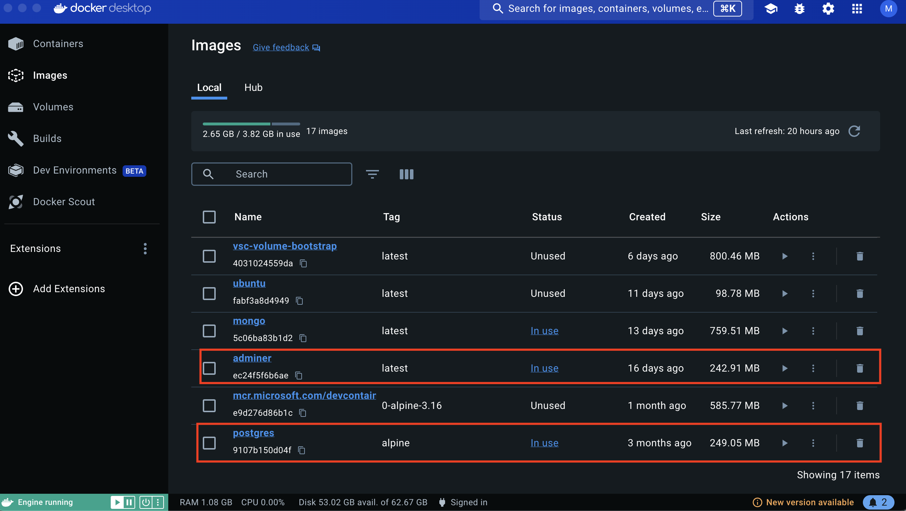

# CAP-PostgreSQL 

This exercise is a demo of building CAP service using PostgreSQL as the database. 

# Step 1: 

Initalize the cap project using the command `cds init` in the root directory of the project folder. 

Execute the command `npm install` to install the dependencies. 

You can now start the cap server using the command `cds watch`. This will start the cap server on `http://localhost:4004`. 

The service would now be empty without any entities defined. 


# Step 2: Entity Declaration

To add the entity definition, create a file called `schema.cds` in the `db` folder and define the following entity type. 

```cds
namespace com.demo.timesheet;

using {cuid} from '@sap/cds/common';

entity Projects : cuid {
    project     : String(50);
    projectDesc : String(100);
    customer    : String(20);
    start_date  : Date;
    end_date    : Date;
}

```

# Step 3: Service Definition

Create a service file to expose the entity. To create a service file, create a file named `schema.cds` in the folder `srv` and implement the following code to expose the entity.
In this step, it is optional to add `@restrict` annotation, to provide user restrictiction. If you skip this step here, then the #Step4 can be skipped.  

```cds
using {com.demo.timesheet as timesheet} from '../db/schema';

service Projects {
    entity Projects @(restrict: [
        {
            grant: [
                'READ',
                'POST'
            ],
            to   : ['Employee']
        },
        {
            grant: ['DELETE'],
            to   : ['Admin ']
        }
    ]) as projection on timesheet.Projects;

    annotate Projects with @odata.draft.enabled;
}
```

# Step 4: Adding Mock User

In the `.cdsrc.json` add the mock user to authenticate the service via `mocked` strategy. 

```json
{
    "[development]": {
       "auth" : {
            "passport": {
                "strategy": "mock",
                "users": {
                    "Employee": {
                        "ID": "employee",
                        "password": "12345",
                        "roles": ["Employee"]
                    },
                    "Admin": {
                        "ID": "admin",
                        "password": "12345",
                        "roles": ["Employee","Admin"]
                    }
                }
            }   
       } 
    }
}

```

# Step 5: Set up PostgreSql database. 

> Pre-requisite: Download and install the `Docker Desktop` on your machine. 

Import the image for `PostgreSql` database and supporting tool `Adminer` to access the database. 
To add the image, create a file named `docker-compose.yaml` and add the following services. 

```yml
version: '3.1'

services:
  db:
    image: postgres:alpine
    restart: always
    environment:
      POSTGRES_PASSWORD: 'postgres'
    ports:
      - '5432:5432'
  adminer:
    image: adminer
    restart: always
    ports:
      - 8080:8080
```

In the above yaml definition, we are adding import for two services . 

1. Create a container named `db` and in that container, import the image `postgres:alphine`. In the environment variable, set the password to access the postgress database as `postgres`. 
This will also be the username of the database. Some of the other environment variables you can set are. The postgres database runs on the port 5432. 

```env
    POSTGRES_USER : '<Username>'
    POSTGRES_PASSWORD: '<Password>'
    POSTGRES_DATABASE: '<Database>'
```

2. Create a container named `adminer` and add the image `adminer`. The Adminer runs on the port `8080`.


# Step 6: Run the docker container. 

To start the container, in the terminal navigate to the root folder of the application, where the `docker-compose.yaml` file is created. 

Run the command `docker compose up` to start the docker container. 

Open the `docker desktop` and you will able to see two new images created for the database `postgres` and `adminer` in the images section. 


