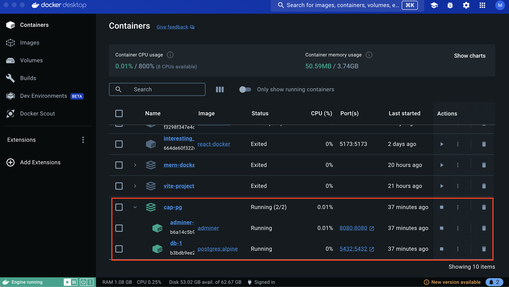
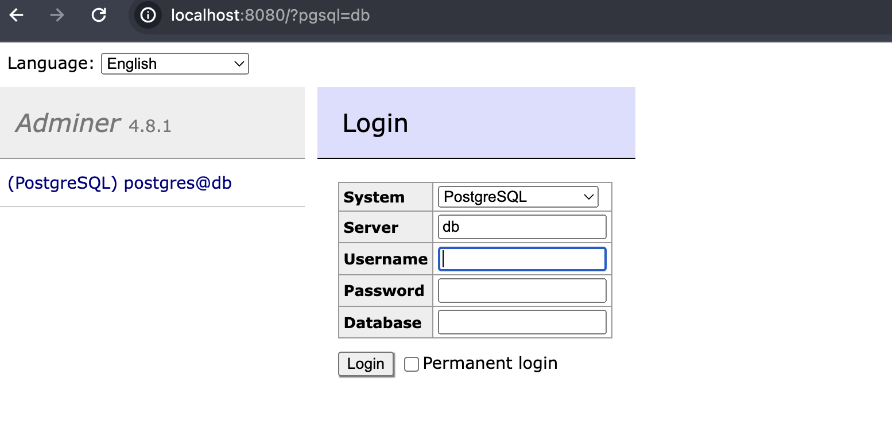
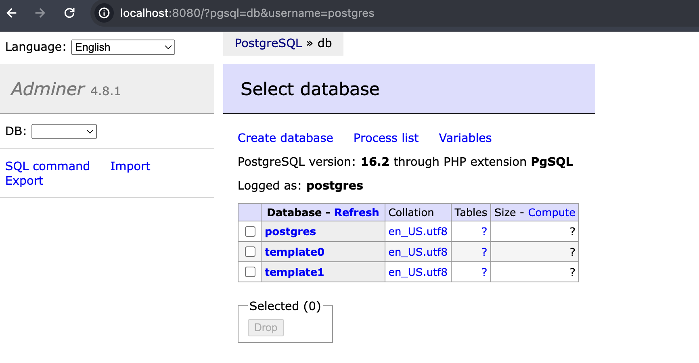
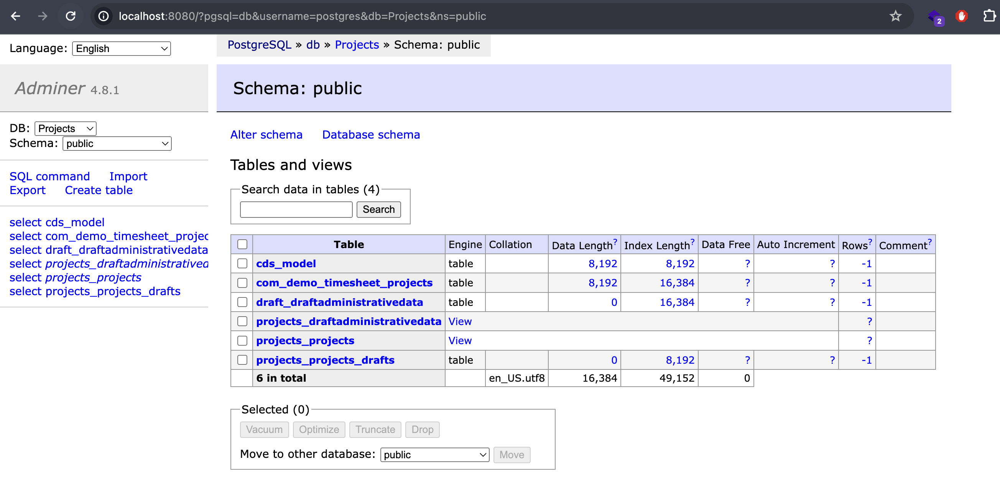

# CAP-PostgreSQL 

This exercise is a demo of building CAP service using PostgreSQL as the database. 

# Step 1: 

Initalize the cap project using the command `cds init` in the root directory of the project folder. 

Execute the command `npm install` to install the dependencies. 

You can now start the cap server using the command `cds watch`. This will start the cap server on `http://localhost:4004`. 

The service would now be empty without any entities defined. 


# Step 2: Entity Declaration

To add the entity definition, create a file called `schema.cds` in the `db` folder and define the following entity type. 

```cds
namespace com.demo.timesheet;

using {cuid} from '@sap/cds/common';

entity Projects : cuid {
    project     : String(50);
    projectDesc : String(100);
    customer    : String(20);
    start_date  : Date;
    end_date    : Date;
}

```

# Step 3: Service Definition

Create a service file to expose the entity. To create a service file, create a file named `schema.cds` in the folder `srv` and implement the following code to expose the entity.


```cds
using {com.demo.timesheet as timesheet} from '../db/schema';

service Projects {
    entity Projects as projection on timesheet.Projects;
    annotate Projects with @odata.draft.enabled;
}
```

# Step 4: Set up PostgreSql database. 

> Pre-requisite: Download and install the `Docker Desktop` on your machine. 

Import the image for `PostgreSql` database and supporting tool `Adminer` to access the database. 
To add the image, create a file named `docker-compose.yaml` and add the following services. 

```yml
version: '3.1'

services:
  db:
    image: postgres:alpine
    restart: always
    environment:
      POSTGRES_PASSWORD: 'postgres'
    ports:
      - '5432:5432'
  adminer:
    image: adminer
    restart: always
    ports:
      - 8080:8080
```

In the above yaml definition, we are adding import for two services . 

1. Create a container named `db` and in that container, import the image `postgres:alphine`. In the environment variable, set the password to access the postgress database as `postgres`. 
This will also be the username of the database. Some of the other environment variables you can set are. The postgres database runs on the port 5432. 

```env
    POSTGRES_USER : '<Username>'
    POSTGRES_PASSWORD: '<Password>'
    POSTGRES_DATABASE: '<Database>'
```

2. Create a container named `adminer` and add the image `adminer`. The Adminer runs on the port `8080`.


# Step 5: Run the docker container. 

To start the container, in the terminal navigate to the root folder of the application, where the `docker-compose.yaml` file is created. 

Run the command `docker compose up` to start the docker container. 

Open the `docker desktop` and you will able to see two new images created for the database `postgres` and `adminer` in the images section. 


In the container section, you will be able to see the running container for the project. 



Click on the hyperlink in the adminer instance to open the local host on port `8080`. 

In the adminer login page, enter the username as `postgres` and password as `postgres` to login to the database. 



After login, you must now be able to see the databases available inside the container.




# Step 6: Create a new database for the Project. 

This step of creating the new database can be done at the time of instantiating the container itself by specifiying the environment variable `POSTGRES_DATABASE` in the `docker-compose.yaml`.
In this exercise, we will create a database from the `adminer`. 

Click on create database, and enter the name for database.


# Step 7: Add postgres adapter plugin to CAP application.

To add postgres to the Cap application, execute the command 

```sh
    cds add postgres
```

This step will add the plugin @cap-js/postgres to the dependencies. 

For more information, refer to the link below:

https://cap.cloud.sap/docs/guides/databases-postgres    

> Note: In my project, the version of @sap/cds was at ^6.8.4. The @cap-js/postgres require the dependency of the @sap/cds to be ^7.x.x. I have upgraded the package to install the postgres db. 

Execute the command `npm install` to install the dependent package `@cap-js/postgres` if it is not already installed to the `node_modules`. 

Package.json

```json
{
  "name": "cap-pg",
  "version": "1.0.0",
  "description": "A simple CAP project.",
  "repository": "<Add your repository here>",
  "license": "UNLICENSED",
  "private": true,
  "dependencies": {
    "@sap/cds": "^7.9.0",
    "express": "^4",
    "latest": "^0.2.0",
    "@cap-js/postgres": "^1"
  },
  "devDependencies": {
    "sqlite3": "^5.0.4"
  },
  "scripts": {
    "start": "cds run"
  }
}
```

# Step 8: Configure PostgreSQL Database 

In the `package.json` or `.cdsrc.json` add the required configuration to connect to the PostgreSQL database. 


```json:highlight={2-10}
{   
    "requires": {
        "db": {
            "kind": "postgres",
            "impl": "@cap-js/postgres",
            "credentials": {
                "host": "localhost",
                "port": 5432,
                "user": "postgres",
                "password": "postgres",
                "database": "Projects"
            }
        }
    }
}
```

To deploy the tables the postgres database, execute the command `cds build` and then `cds deploy`.

In the adminer, you can see the tables created in the database. 




# Step 9: Build and Deploy the service 

Execute the following commands to build and deploy the application. 

Set the endpoint where you want to deploy the service. 

```sh
  cf api <endpoint>
```

Login and authenticate. 

```sh
  cf login / cf login --sso
```

Add xsuaa to the application. 

```sh
  cds add xsuaa 
```

This step will create a file called `xs-secuirty.json`.  Here you can define the roles and scopse needed for the application. 

```json
{
  "scopes": [],
  "attributes": [],
  "role-templates": []
}
```

Add the mta configuration file by executing the command `cds add mta`. This will create a file called `mta.yaml` and add the required configuration. 

```yaml
_schema-version: '3.1'
ID: cap-pg
version: 1.0.0
description: "A simple CAP project."
parameters:
  enable-parallel-deployments: true
build-parameters:
  before-all:
    - builder: custom
      commands:
        - npm ci
        - npx cds build --production
modules:
  - name: cap-pg-srv
    type: nodejs
    path: gen/srv
    parameters:
      buildpack: nodejs_buildpack
      readiness-health-check-type: http
      readiness-health-check-http-endpoint: /health
    build-parameters:
      builder: npm
    provides:
      - name: srv-api # required by consumers of CAP services (e.g. approuter)
        properties:
          srv-url: ${default-url}
    requires:
      - name: cap-pg-postgres
      - name: cap-pg-auth

  - name: cap-pg-postgres-deployer
    type: nodejs
    path: gen/pg
    parameters:
      buildpack: nodejs_buildpack
      no-route: true
      no-start: true
      tasks:
        - name: deploy-to-postgresql
          command: npm start
    requires:
      - name: cap-pg-postgres

resources:
  - name: cap-pg-postgres
    type: org.cloudfoundry.managed-service
    parameters:
      service: postgresql-db
      service-plan: trial
  - name: cap-pg-auth
    type: org.cloudfoundry.managed-service
    parameters:
      service: xsuaa
      service-plan: application
      path: ./xs-security.json
      config:
        xsappname: cap-pg-${org}-${space}
        tenant-mode: dedicated

```

Build the tar file by executing command `mbt build`. 

Deploy the application by executing the command `cf deploy mta_archives/..name of build...`.


